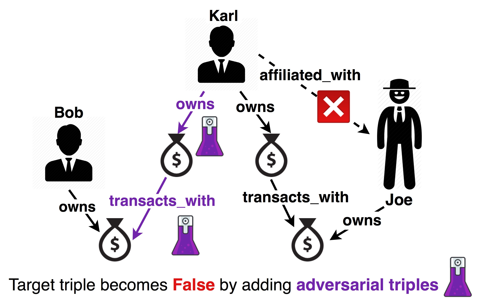

<h1 align="left">
  Poisoning Knowledge Graph Embeddings <br> via Relation Inference Patterns
</h1>

<p align="left">
  <a href="https://aclanthology.org/2021.acl-long.147/"></a>
  <a href="https://aclanthology.org/2021.acl-long.147.pdf"></a>
  <a href="https://underline.io/lecture/25460-poisoning-knowledge-graph-embeddings-via-relation-inference-patterns"></a>
  <a href="https://aclanthology.org/2021.acl-long.147/"></a>
  <a href="https://underline.io/events/167/sessions?eventSessionId=5520"></a>
</p>

<p align="left">
    <a href="https://arxiv.org/abs/2111.06345"></a>
    <a href="https://github.com/PeruBhardwaj/InferenceAttack/blob/master/LICENSE"></a>
</p>

<h4 align="left">This is the code repository to accompany the ACL 2021 paper on poisoning attacks on KGE models. <br>
The work is a part of my PhD study at Trinity College Dublin and is funded by Accenture Labs and ADAPT Centre. <br>
For any questions or feedback, add an issue or email me at: bhardwap at tcd dot ie</h4>

### Related Publications
1. Adversarial Attacks on Knowledge Graph Embeddings via Instance Attribution Methods (EMNLP 2021) - <a href="https://aclanthology.org/2021.emnlp-main.648/">Paper</a>, <a href="https://github.com/PeruBhardwaj/AttributionAttack">Codebase</a>
2. Adversarial Robustness of Representation Learning for Knowledge Graphs (PhD Thesis) - <a href="http://www.tara.tcd.ie/bitstream/handle/2262/101176/Thesis_PeruBhardwaj.pdf">Link</a>

## Overview

The figure illustrates the composition based adversarial attack on missing link prediction for fraud detection. The knowledge graph consists of two types of entities - `Person` and `BankAccount`. The target triple to predict is `(Karl, affiliated with, Joe the mobster)`. Original KGE model predicts this triple as True, i.e. assigns it a higher rank than the synthetic negative triples. But a malicious attacker can add adversarial triples (in purple) that connect `Karl` with a non-suspicious person `Bob` through composition pattern. Now, the KGE model predicts the target triple as False. 

Thus, the proposed adversarial attacks are based on a reformulation of the problem of poisoning attacks on KGE models for missing link prediction. Instead of degrading the rank of a target triple directly, the attacker aims to improve the rank of a *decoy triple*. To do so, they exploit the inductive abilities of KGE models which are expressed through connectivity patterns like symmetry, inversion or composition. This problem reformulation for poisoning attacks also helps to understand the behaviour of KGE models because the extent of effectiveness of the attack relying on an inference pattern indicates the KGE model's sensitivity to that inference pattern.

## Reproducing the results

### Setup
- python = 3.8.5
- pytorch = 1.4.0
- numpy = 1.19.1
- jupyter = 1.0.0
- pandas = 1.1.0
- matplotlib = 3.2.2
- scikit-learn = 0.23.2
- seaborn = 0.11.0

Experiments reported in the paper were run in the conda environment `inference_attack.yml`


### Usage
- The codebase and the bash scripts used for experiments are in `KGEAttack`
- To add the necessary directories and preprocess the original datasets, use the bash script `preprocess.sh`
- For each model-dataset combination, there is a bash script to train the original model, generate attacks from baselines and proposed attacks; and train the poisoned model. These scripts are named as `model-dataset.sh`
- The instructions in these scripts are grouped together under the echo statements which indicate what they do.
- The hyperparameters in bash scripts are the ones used for the experiments reported in the paper.
- The metrics on decoy triples can be computed by the script `compute_decoy_metrics_WN18RR.sh` or `compute_decoy_metrics_FB15k-237.sh`
- To reproduce the results, specific instructions from the bash scripts can be run individually on the commandline or the full script can be run.
- All experiments in the paper were run on a shared HPC cluster that had Nvidia RTX 2080ti, Tesla K40 and V100 GPUs.


## References
Parts of this codebase are based on the code from following repositories 
- [ConvE](https://github.com/TimDettmers/ConvE)
- [CRIAGE](https://github.com/pouyapez/criage)
- [KGC Re-evalaution](https://github.com/svjan5/kg-reeval)
- [ComplEx-N3](https://github.com/facebookresearch/kbc)


## Citation

```bibtex
@inproceedings{bhardwaj-etal-2021-poisoning,
    title = "Poisoning Knowledge Graph Embeddings via Relation Inference Patterns",
    author = "Bhardwaj, Peru  and
      Kelleher, John  and
      Costabello, Luca  and
      O{'}Sullivan, Declan",
    booktitle = "Proceedings of the 59th Annual Meeting of the Association for Computational Linguistics and the 11th International Joint Conference on Natural Language Processing (Volume 1: Long Papers)",
    month = aug,
    year = "2021",
    address = "Online",
    publisher = "Association for Computational Linguistics",
    url = "https://aclanthology.org/2021.acl-long.147",
    pages = "1875--1888"
    }
```
